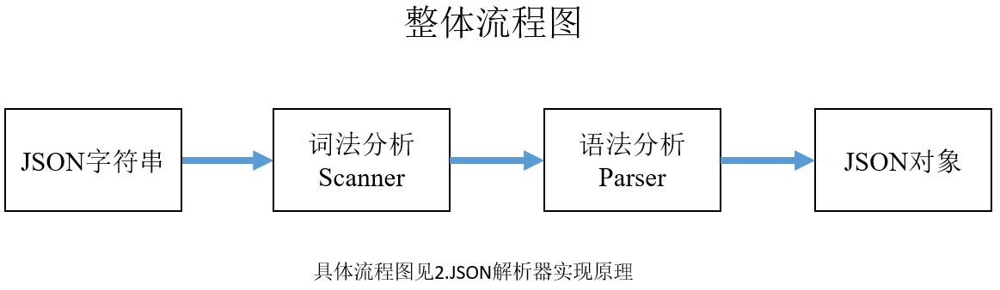
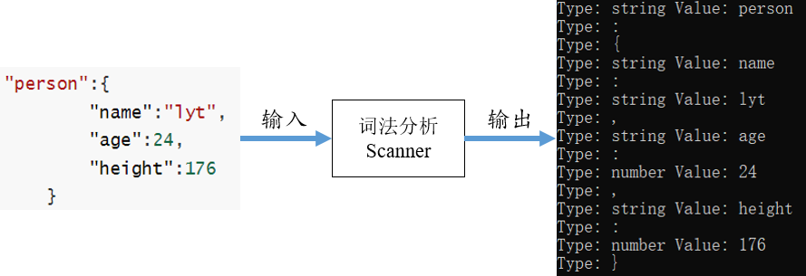
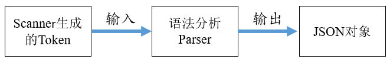

[TOC]



# 1.什么是json

​		JSON（JavaScript Object Notation, JS对象简谱）是一种轻量级的数据交换格式。它基于 ECMAScript（European Computer Manufacturers Association, 欧洲计算机协会制定的js规范）的一个子集，采用完全独立于编程语言的文本格式来存储和表示数据。简洁和清晰的层次结构使得 JSON 成为理想的数据交换语言。 易于人阅读和编写，同时也易于机器解析和生成，并有效地提升网络传输效率。

​		JSON格式有以下基本类型：

- null类型：值为null，表示为空
- bool类型：值为true和false
- number类型
- string类型

- array类型（例如["hello","world"]）
- object类型（例如{"name":"lyt","man":true}）

​		例如以下json描述了我的名字，年龄和身高

```json
{
	"person":{
		"name":"lyt",
		"age":24,
		"height":176
	}
}
```

json的完整定义见：https://www.rfc-editor.org/rfc/rfc7159.html

# 2.JSON解析器实现原理

​		JSON解析器从本质上来说就是根据JSON文法规则创建的状态机，输入是一个JSON字符串，输出是一个JSON对象。

​		一般来说，解析过程包括**词法分析**和**语法分析**两个阶段。词法分析阶段的目标是按照构词规则将JSON字符串解析成Token流。





​		词法分析解析出Token序列后，接下来要进行语法分析。语法分析的目的是根据JSON文法检查上面Token序列所构成的JSON结构是否合法。比如JSON文法要求非空Object对象以键值对的形式出现，如果传入了一个格式错误的字符串，那么在语法分析阶段，语法分析器分析完Token的name后，认为它是一个符合规则的Token，并且认为它是一个键。接下来，语法分析器读取下一个Token，期望这个Token 是 ":"。但当它读取了这个Token，发现这个Token是","并非其期望的":"，于是分析器就会报错误。

```json
假设已经判断为是一个Object类型
{
    错误的格式 "name", "lyt"  （报错）
    正确的格式 "name": "lyt"  
}
(具体的判断对错见第四部分parser剖析代码)
```

# 3.代码scanner剖析

​		在 JSON 中，构词规则对应于几种数据类型，当词法解析器读入某个词，且这个词类型符合 JSON 所规定的数据类型时，词法分析器认为这个词符合构词规则，就会生成相应的 Token。

​		当词法分析器读取的词是JSON数据类型中的一种时，即可将其解析成一个Token。我们可以定义一个枚举类来表示JSON的数据类型，如下：

```c++
enum class JsonTokenType {
        BEGIN_OBJECT,   	// {
        END_OBJECT,     	// }   
        COLON_SEPARATOR, 	// :       
        COMMA_SEPARATOR, 	// ,
        VALUE_NUMBER,  		//number
        VALUE_STRING,  		//string
        LITERAL_TRUE,
        LITERAL_FALSE,
        LITERAL_NULL,
        BEGIN_ARRAY,    	//  [
        END_ARRAY,      	//  ]
        END_OF_SOURCE  		//标志解析完成
    };
```

​		接下来定义读取字符串的函数

```
//从当前扫描位置出发，扫描接下来的，并返回下来的token类型
JsonTokenType Scan();
```

​		具体词法分析器的实现见scanner.h和scanner.cpp

​		下面选取部分代码，在Scan函数中，通过循环不停的读取字符，然后再根据字符的类型，执行不同的解析逻辑。在解析时，只需通过每个词第一个字符即可判断出这个词的 Token Type。比如：

- 第一个字符是`{`、`}`、`[`、`]`、`,`、`:`，直接封装成相应的 Token 返回即可
- 第一个字符是`n`，期望这个词是`null`，Token 类型是`NULL`
- 第一个字符是`t`或`f`，期望这个词是`true`或者`false`，Token 类型是 `BOOL`
- 第一个字符是`"`，期望这个词是字符串，Token 类型为`String`
- 第一个字符是`0~9`或`-`，期望这个词是数字，类型为`NUMBER`

​		举例说明遇见t和f时 代码的判断

```c++
 case 't':
     ScanTrue(); //判断必须是true 这种，不能是trueff，tru这种
     return JsonTokenType::LITERAL_TRUE;
 case 'f':
     ScanFalse();
     return JsonTokenType::LITERAL_FALSE;
     
//验证是否是true这种形式
void Scanner::ScanTrue() {
    //往后数三位
    if (source_.compare(current_, 3, "rue") == 0) {
        current_ += 3;
    }
    else {
        Error("Scan `true` error");
    }
}
//验证是否是false这种形式
void Scanner::ScanFalse() {
    if (source_.compare(current_, 4, "alse") == 0) {
        current_ += 4;
    }
    else {
        Error("Scan `false` error");
    }
}
```

​		遇见number类型时的解析过程

```c++
 case '-':
 case '0':
 case '1':
 case '2':
 case '3':
 case '4':
 case '5':
 case '6':
 case '7':
 case '8':
 case '9':
     ScanNumber();
     return JsonTokenType::VALUE_NUMBER;

void Scanner::ScanNumber() {
    size_t pos = current_ - 1;
    //例如 -99 负数
    while (IsDigit(Peek())) {
        Advance();
    }

    // 例如9.99 有小数
    if (Peek() == '.' && IsDigit(PeekNext())) {
        Advance();
        while (IsDigit(Peek())) {
            Advance();
        }
    }
    value_number_ = std::atof(source_.substr(pos, current_ - pos).c_str());
}
```

​		string，null类型等其余见源码

# 4.代码parser剖析

​		当词法分析结束后，且分析过程中没有抛出错误，那么接下来就可以进行语法分析了。语法分析过程以词法分析阶段解析出的 Token 序列作为输入，输出 JSON Object 

​		创建一个JsonElement类，将json的类型对应到计算机语言的类型。		

```c++
enum class Type {
        JSON_OBJECT,
        JSON_ARRAY,
        JSON_STRING,
        JSON_NUMBER,
        JSON_BOOL,
        JSON_NULL
    };
union Value {
    JsonObject* value_object;
    JsonArray* value_array;
    std::string* value_string;
    float value_number;
    bool value_bool;
};
//object类型对应C++的map
//array类型对应C++的vector
using JsonObject = std::map<std::string, JsonElement*>;
using JsonArray = std::vector<JsonElement*>;
```

​		Parse()读取Token，按照不同的JsonTokenType进行解析。

```c++
JsonTokenType token_type = scanner_.Scan();
switch (token_type) 
{
	case JsonTokenType::END_OF_SOURCE: {
		break;
	}
	case JsonTokenType::BEGIN_OBJECT: {
		JsonObject* object = ParseObject();
        element->value(object);
        break;
    }
    case JsonTokenType::BEGIN_ARRAY: {
        JsonArray* array = ParseArray();
        element->value(array);
        break;
    }
    case JsonTokenType::VALUE_STRING: {
        std::string* val = new std::string(scanner_.GetValueString());
        element->value(val);
        break;
    }
    case JsonTokenType::VALUE_NUMBER: {
        float val = scanner_.GetValueNumber();
        element->value(val);
        break;
    }
    case JsonTokenType::LITERAL_TRUE: {
        element->value(true);
        break;
    }
    case JsonTokenType::LITERAL_FALSE: {
        element->value(false);
        break;
    }
    case JsonTokenType::LITERAL_NULL: {
        break;
    }
    default:
    	break;
    }   
}
```

​		对于处理object和array类型，两个核心函数是ParseObject()，ParseArray()。下面举例ParseObject()代码

```c++
JsonObject* Parser::ParseObject() {
    JsonObject* res = new JsonObject();

    JsonTokenType next = scanner_.Scan();
    if (next == JsonTokenType::END_OBJECT) {
        return res;
    }
    scanner_.Rollback();

    while (true) {
        //key
        next = scanner_.Scan();
        if (next != JsonTokenType::VALUE_STRING) {
            Error("键必须是string类型!");
        }
        std::string key = scanner_.GetValueString();
        // :
        next = scanner_.Scan();
        if (next != JsonTokenType::COLON_SEPARATOR) {
            Error("缺少冒号！");
        }
        (*res)[key] = Parse();
        next = scanner_.Scan();
        if (next == JsonTokenType::END_OBJECT) {
            break;
        }
        if (next != JsonTokenType::COMMA_SEPARATOR) {
            Error("缺少逗号！");
        }
    }
    return res;
}
```

​		解析完 `{` Token 后，接下来它将期待 STRING 类型的 Token 或者 END_OBJECT 类型的 Token 出现。于是 parseJsonObject 读取了一个新的 Token，发现这个 Token 的类型是 STRING 类型，则添加键，同时判断是否具有冒号，如此循环下去，直至 Token 序列解析结束或者抛出异常退出。

​		ParseArray()见源码。

# 5.测试

**测试的json字符串**

```json
{
    "person":{
		"name":"lyt",		
        "age":24,
	    "height":176,
        "student":true,
        "hobby":["football","LEGO","music"],
        "null":null
    }
}
```

**对scanner进行测试**

输出结果

```json
Type: { 
Type: string Value: person
Type: :
Type: {
Type: string Value: name
Type: :
Type: string Value: lyt
Type: ,
Type: string Value: age
Type: :
Type: number Value: 24
Type: ,
Type: string Value: height
Type: :
Type: number Value: 176
Type: ,
Type: string Value: student
Type: :
Type: true
Type: ,
Type: string Value: hobby
Type: :
Type: [
Type: string Value: football
Type: ,
Type: string Value: LEGO
Type: ,
Type: string Value: music
Type: ]
Type: ,
Type: string Value: null
Type: :
Type: null
Type: }
Type: }
```

**对parser进行测试**

输出结果

```json
{"person": {"age": 24, "height": 176, "hobby": ["football", "LEGO", "music"], "name": "lyt", "null": null, "student": true}}
```

# 6.参考资料

```html
https://github.com/ACking-you/MyUtil/tree/master/json-parser
https://hanqi-blog.com/posts/json/
https://github.com/Civitsv/mini-json-parser
https://github.com/nlohmann/json
http://www.json.org/json-en.html
https://github.com/StephenChips/cppjson
https://www.rfc-editor.org/rfc/rfc7159.html
```

